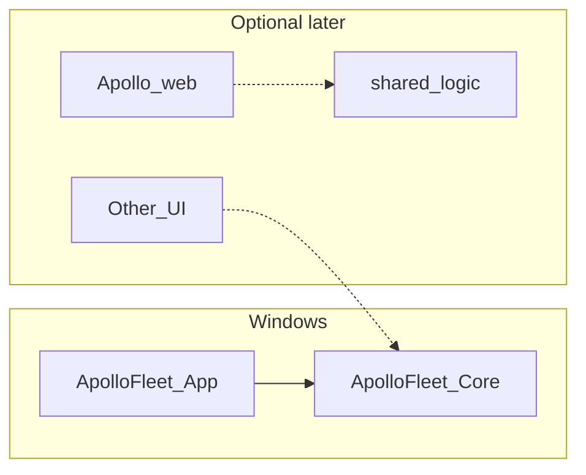
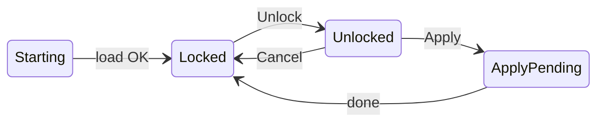

---
name: winui-port
overview: "WinUI 3 desktop app: multi-instance Apollo host management, full UI/UX spec, Core logic, Windows integration, i18n+RTL (en/ar), phased implementation — see Detailed implementation specification."
todos:
  - id: skeleton
    content: Add ApolloFleet.Core (net8.0) + ApolloFleet.App (WinUI 3); app settings + culture hook
    status: pending
  - id: core-domain
    content: Fleet config + apps.json merge in Core with unit tests (conf merge, boolean JSON preservation)
    status: pending
  - id: json-booleans
    content: Preserve JSON booleans for all relevant apps.json keys Apollo expects (e.g. exclude-global-state-cmd, terminate-on-pause)
    status: pending
  - id: port-ux
    content: Validated port entry, no spurious reset, explicit duplicate-port errors
    status: pending
  - id: settings-safety
    content: Transactional settings + validation (no empty fleet overwrite); export/import optional later
    status: pending
  - id: apollo-missing-ui
    content: If sunshine.exe missing — status strip shows one localized hyperlink to official Apollo releases
    status: pending
  - id: winui-ui
    content: WinUI pages — instances, paths, manager options; lock/apply/reload flow
    status: pending
  - id: diagnostics
    content: Per-instance Web UI URL, log tail, health (process + optional port listen)
    status: pending
  - id: elevation-spike
    content: Research spike — session-correct elevated Sunshine launch; pick approach then IProcessLauncher
    status: pending
  - id: os-layer
    content: Task Scheduler, ApolloService toggle, process supervision + cleanup, optional NAudio volume sync
    status: pending
  - id: release-ci
    content: GitHub Actions — build/test + publish folder artifact to Releases; README SmartScreen + uninstall
    status: pending
  - id: boot-reliability
    content: Staggered instance start, retry/backoff, structured file logging
    status: pending
  - id: start-minimized
    content: Setting to start minimized / tray-first
    status: pending
  - id: i18n-rtl
    content: en-US + ar-SA .resw, x:Uid, RTL FlowDirection QA
    status: pending
isProject: false
---

# winui-port — Apollo fleet manager (WinUI 3)

## Product decisions

- **Persistence**: New **JSON-based** app settings and separate runtime state file. **No** import of settings from other tools or formats.
- **Data safety**: Transactional saves and validation so an empty or invalid fleet cannot overwrite good data without explicit user confirmation (optional dialog in a later iteration).
- **Elevation**: Research **session-correct** Sunshine launch (UAC-safe); document chosen approach before hardcoding `Process.Start` everywhere.
- **Distribution**: **GitHub Releases**, unsigned acceptable for v1 (**SmartScreen** expected). **Unpackaged** or single-folder publish from CI.
- **Apollo target**: Latest stable **Apollo** at implementation time; document minimum tested version in README.
- **Apollo missing UI**: **One** localized **hyperlink** in the status area to official Apollo releases — no in-app downloader or installer.
- **Scope**: **No** Android helpers (no reverse tether, ADB, scrcpy, bundled platform-tools, or related UI).

## Open points to resolve during build

- **Web UI URL**: Confirm HTTPS port vs streaming port for the Apollo version you ship against; centralize in `WebUiPortResolver`.
- **Elevation**: After spike, lock `IProcessLauncher` implementation and update OS-layer tasks.

## Goals

- **Standalone Windows app** to run and manage **multiple Apollo** (`sunshine.exe`) instances: isolated configs, ports, logs, state, `apps.json`, lifecycle, optional volume sync, logon task vs stock **ApolloService** when present.
- **Stack**: **WinUI 3** (Fluent). **i18n**: **English + Arabic** with **RTL** support from v1.

## Architecture



- **`ApolloFleet.Core`** — `net8.0`: models, settings/state serialization, `apps.json` + `.conf` generation and merge, validation, **no** WinUI references.
- **`ApolloFleet.App`** — WinUI 3: UI, tray, **Windows-only** services (scheduler, service control, processes, NAudio).

---

## Detailed implementation specification

Implementation contract: controls, UX state, persistence, internal APIs, Windows behavior, work order.

### Step 0 — Elevation and process model (spike)

**Goal:** Chosen, documented way to start Sunshine with correct session/elevation.

**Activities:**

1. Compare: PaExec/PsExec-style session launch, small helper run from scheduled task, or documented Apollo-supported modes compatible with **UAC secure desktop**.
2. Document privileges, UAC interaction, failures, AV relevance.
3. Deliverable: `docs/elevation.md` + **`IProcessLauncher`** with one implementation used app-wide.

**Logic:** orchestration calls `IProcessLauncher.StartInstance(exePath, configPath, instanceId)` only.

---

### Step 1 — Solution layout and persistence

**Projects:**

- `ApolloFleet.Core` — `net8.0`, nullable enabled.
- `ApolloFleet.App` — WinUI 3, references Core + Windows packages (e.g. NAudio, CommunityToolkit as needed).

**On-disk:**

- **Settings** (JSON): e.g. `%LocalAppData%\ApolloFleet\settings.json` — manager options, paths, fleet, locale, theme, start minimized.
- **State** (JSON): e.g. `%LocalAppData%\ApolloFleet\state.json` — PIDs, window bounds, log pane open — **never** written in the same unversioned operation as settings.
- **Fleet directory** (user path): `fleet-{id}.conf`, `apps-{id}.json`, per-instance log paths as defined by Core.

**Logic:**

- Startup: load + validate schema; default to one instance if missing.
- Save settings: temp file + atomic replace.
- Save state: debounced; same atomic pattern.
- Guard: do not persist **zero** instances when prior state had instances without explicit user confirm (MVP: validate and block).

---

### Step 2 — Core domain (no UI)

| Module | Responsibility |
|--------|----------------|
| `FleetInstance` | Id, Name, Port, Enabled, AudioDevice (`Unset` or id), Headless → `headless_mode`; `AutoCaptureSink` derived from audio |
| `ManagerOptions` | AutoStart, SyncVolume, RemoveOnDisconnect → `terminate-on-pause`, theme, ShowErrors, StartMinimized |
| `PathOptions` | Apollo install root, fleet config dir, optional helper exe path post-spike |
| `AppsJsonService` | Ensure Desktop app; set `terminate-on-pause`; **all booleans remain JSON true/false** (never `0`/`1` for Apollo boolean keys); round-trip unknown apps |
| `ConfFileService` | Canonical map → merge file; `Unset` **removes** key; static keys e.g. `keep_sink_default` disabled |
| `PortValidator` | 1–65535, unique across instances → UI error resource |
| `WebUiPortResolver` | Streaming port → browser `https://localhost:{n}` (confirm `n` for target Apollo version) |

**Tests:** Realistic `apps.json` samples; boolean stability; conf `Unset` removal.

---

### Step 3 — Internal API (in-process, not HTTP)

**Core-facing:**

```text
ISettingsStore                 LoadAsync / SaveAsync (snapshot)
IFleetConfigurationApplier     ApplyAsync → writes conf + apps.json
IInstanceHealthComputer        Running/Stopped + optional TCP check
```

**App / OS adapters:**

```text
IProcessSupervisor             Start/stop/restart; enumerate sunshine PIDs; graceful stop
IScheduledTaskService          Logon task register/disable; path drift
IWindowsServiceFacade          ApolloService query/configure if installed
IAudioVolumeSink               NAudio volume sync per policy
```

**Logic:** single **`FleetCoordinator`**; ViewModels do not call Win32 except pickers.

---

### Step 4 — Main window UI (WinUI 3)

**Window:** title from `App_DisplayName` (localized). **Close button:** **minimize to tray**; **Exit** only from tray (and optionally File menu) so users always have a clear quit path.

**Shell:** `NavigationView` — primary **`FleetPage`**; **Settings** in footer (dialog or page).

#### 4.1 Command column (RTL-mirrored)

| x:Uid | Type | Resources | Behavior |
|-------|------|-----------|----------|
| `PrimaryActionButton` | Button | `UI_Lock` / `UI_Apply` | See button logic below |
| `SecondaryActionButton` | Button | `UI_Reload` / `UI_Cancel` | Locked → full app reload; unlocked dirty → discard draft |
| `ToggleLogsButton` | Button | `UI_ShowLogs` / `UI_HideLogs` | Toggles logs pane; persist in state |
| `MinimizeButton` | Button | `UI_Minimize` | Minimize window |

**Button logic:**

- **`IsSettingsLocked`**: when **locked**, all path/instance/manager editors **disabled**.
- **Primary:** `HasUnsavedChanges` → **Apply** (save, apply configs, restart supervision); else **Unlock** to edit.
- **Secondary:** locked → **Reload** (restart process); unlocked with changes → **Cancel** (revert draft).

#### 4.2 Group `Group_FleetOptions`

| Control | Resource | Binding |
|---------|----------|---------|
| `AutoStartCheckBox` | `Option_AutoStartFleet` | `AutoStart` |
| `SyncVolumeCheckBox` | `Option_SyncVolume` | `SyncVolume` |
| `RemoveOnDisconnectCheckBox` | `Option_RemoveOnDisconnect` | `RemoveOnDisconnect` → `apps.json` Desktop `terminate-on-pause` |

**Out of scope:** no Android / ADB / tethering / scrcpy UI.

#### 4.3 Group `Group_Fleet`

| Area | Controls |
|------|----------|
| Apollo path | `Label_ApolloFolder`, `ApolloPathText`, `BrowseApolloButton`, status glyph |
| Instances | `InstanceList` (name, port, enabled subtitle); `AddInstanceButton`, `RemoveInstanceButton` (+ confirm) |
| Detail | `InstanceName`, `InstancePort` (`NumberBox`), `InstanceAudio` (`ComboBox` + `Unset` + devices), `InstanceEnabled` + runtime status text, `InstanceHeadless`, `InstanceWebUiLink` (HTTPS, **LTR** inside RTL) |

**Apollo missing:** `DownloadApolloLink` only — `https://github.com/ClassicOldSong/Apollo/releases` (localized text).

#### 4.4 Status strip

`StatusApollo`, `StatusMessage`, `DownloadApolloLink` (visible if Apollo not found).

**Out of scope:** no auxiliary Android status icons.

#### 4.5 `LogsPane`

`LogViewer` (tail selected instance log); optional `LogSourceCombo` later. Timer-based async read.

#### 4.6 Settings

`LanguageCombo` (en-US / ar-SA), `ThemeCombo`, `StartMinimizedCheckBox`, `ShowErrorsCheckBox`.

---

### Step 5 — Tray

**Menu:** Open, Reload, separator, Exit. **Tooltip:** e.g. “Apollo Fleet — 2/2 running” (localized).

---

### Step 6 — UX state machine



**Apply:** validate → `IFleetConfigurationApplier` → atomic save → supervisor (stagger + retry) → task service if needed → volume loop if on.

**Reload:** locked → restart application process; unlocked → reload settings from disk without exit.

---

### Step 7 — Service and scheduled task

**Task name:** e.g. `ApolloFleet` or product-specific constant (document in README).

**AutoStart on:** if `ApolloService` exists → stop, disable; register **logon** task, **~30s delay**, **highest available**, action = this app executable.

**AutoStart off:** disable/remove logon task; if `ApolloService` exists → restore auto + start.

Errors → `StatusMessage` + file log.

---

### Step 8 — Process supervision

- Per-instance timer (~5s): restart dead PID via `IProcessLauncher`.
- Stagger starts after apply/boot.
- State file holds PIDs.
- Global cleanup (~1s): kill `sunshine.exe` not in keep list; delete orphan files under fleet dir not referenced by snapshot.
- Graceful stop: console **Ctrl+C**-style signal if applicable; else kill after timeout.

---

### Step 9 — Volume sync

If `SyncVolume`: timer reads default playback volume/mute; per-instance session or endpoint volume for Sunshine PIDs per audio routing rules. If off: stop timer.

---

### Step 10 — i18n / RTL

`.resw` for `en-US`, `ar-SA`; `x:Uid` everywhere; root `FlowDirection` RTL for `ar`; URLs LTR; log timestamps ISO 8601.

---

### Step 11 — CI / release

Build, test, zip folder to GitHub Releases; README: install, uninstall (folder + scheduled task), SmartScreen, Apollo link.

---

### Step 12 — Implementation order

1. Elevation spike + `IProcessLauncher`.
2. Core models + `AppsJsonService` + `ConfFileService` + tests.
3. Settings/state + atomic I/O.
4. WinUI static layout.
5. ViewModels + lock/apply.
6. Scheduler + service facade.
7. Process supervisor + cleanup.
8. Volume sync.
9. Tray + start minimized.
10. Logs + Web UI link + health.
11. i18n + RTL.
12. CI.

---

## Feature scope

| Area | Include |
|------|--------|
| Instances | CRUD; name, port, enabled, headless, per-instance audio |
| Paths | Apollo folder, fleet config directory, optional helper path |
| Config | Per-instance `fleet-{id}.conf`; `apps-{id}.json` with Desktop + `terminate-on-pause` from “remove on disconnect”; `Unset` omits keys |
| Processes | Supervise instances; cleanup stray `sunshine.exe`; persist PIDs |
| Autostart | Logon scheduled task + delay; cooperate with `ApolloService` when installed |
| Volume | Optional sync to instances |
| UX | Lock/apply/cancel/reload, tray, logs panel, per-instance Web UI link |
| Excluded | Android client tooling and UI |

### Apollo not installed

If `sunshine.exe` missing: **one** localized **hyperlink** in the status area to official Apollo releases; user installs manually, then sets path in app.

---

## Quality targets (no external tracker references)

- **i18n/RTL**: First-class `en-US` + `ar-SA`; scalable to more locales via `.resw`.
- **Ports**: Valid range, no destructive mid-edit resets, duplicates rejected with clear message.
- **JSON**: Boolean fields in `apps.json` stay boolean through merge/edit.
- **Layout**: Fluent layout scales on high-DPI (no fixed pixel-only dialogs).
- **Persistence**: Atomic writes; never silently wipe fleet.
- **Diagnostics**: Correct Web UI URL per instance; log viewer reads configured log paths; optional TCP listen check.
- **Reliability**: Staggered multi-instance start, retries, file logging for supervision.
- **Startup**: Optional start minimized.
- **Docs**: Optional port-forward summary for remote access; README uninstall steps.

---

## i18n and RTL (summary)

- String resources + `x:Uid`.
- Persist culture; `PrimaryLanguageOverride` when user overrides system.
- RTL root; mirrored command column; LTR for URLs.

## Risk / legal

- **Elevation** helpers may trigger AV heuristics — document and prefer signing when budget allows.
- **Apollo** is **GPLv3**; this app is separate unless you embed Apollo **source** — respect license if bundling or redistributing Apollo binaries.

## Implementation phases (pointer)

Follow **Step 12** and sections **4–5** above.

## Deferred

- **Linux / Uno** — optional; Core stays portable.
- **UI inside Apollo’s web app** — separate effort; reuse Core patterns if useful.
